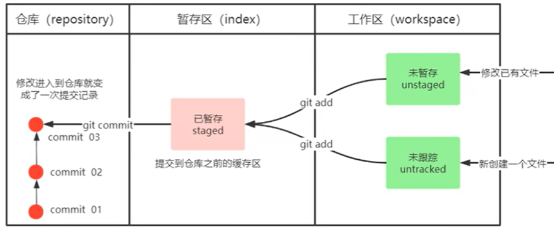

# Git

集中式版本控制工具：版本库集中存放于中央服务器

分布式版本控制工具：每个参与项目的人电脑上都有一个完整的版本库，工作时无需联网，多人协作只需要将各自的修改推送给对方


## 工作流程

```
远程仓库（抓取/克隆、推送）本地仓库
```

- clone：从远程仓库中克隆代码到本地
- checkout：检出，从本地仓库中检出一个仓库分支然后修改、提交
- add：添加，在提交之前将代码提交到暂存区
- commit：提交，提交到本地仓库，本地仓库中保存修改的各个历史版本
- fetch：抓取，从远程库抓取到本地仓库
- pull：拉取，从远程库拉到本地仓库，自动合并，相当于 fetch + merge
- push：推送，修改完成后，将代码推送到远程仓库

## 基本配置

设置用户信息：

```
git config --global user.name "xxx"

git config --global user.email "xxxx"
```

查看用户信息：

```
git config --global user.name

git config --global user.email
```

## 解决中文乱码问题

在 GitBash 中执行命令：

```
git config --global core.quotepath false
```

在 Git 安装目录下的 `/etc/bash.bashrc` 文件最后加入两行：

```
export LANG="zh_CN.UTF-8"
export LC_ALL="zh_CN.UTF-8"
```

## 基础操作指令

Git 工作目录的几种状态：



- 暂存区：提交到仓库之前的缓存区（git add .）
- 将暂存区内容提交到仓库后，每次提交生成提交记录

主要命令：

- `git status`：查看状态
- `git add .`：将修改添加到暂存区
- `git commit -m '注释内容'`：提交到仓库

### 查看提交日志

使用命令`git log`查看提交日志，可选参数有：

- --all  显示所有分支
- --pretty=oneline  将提交信息显示为一行
- --abbrev-commit  简化输出信息
- --graph  以图的形式显示

为了使用方便，可以使用别名设置简化命令，在`bash.bashrc`：

```
alias git-log='git log --pretty=oneline --all --graph --abbrev-commit'
# alias 用于设置别名 例如：
alias ll='ls -al'

source ~/bash
```

## 版本回退

版本回退用于版本切换：

```
git reset --hard commitID
```

commitID 可以使用 git-log 命令查看，类似

## 通过 ignore 屏蔽不想提交的文件

语法规范：

- `#`：注释

- `*`：用于匹配零个或多个字符：

  ```git
  *.a  -- 忽略 .a 文件
  *.[oa] -- 忽略所有的 .a 和 .o 文件 [] 表示匹配括号内的任意字符，例如[abc]表示匹配a，b，c三个字符
  ```

- `!` ：否定忽略 例如 !a.txt 表示 a.txt 不会被忽略

- `/`：匹配目录

  - `/bin` 表示忽略根目录下的 bin 文件夹，但是不会忽略 bin 文件夹下的子文件夹，例如`/bin/file`
  - `bin/`表示忽略 bin 文件夹下的所有子内容，但是不会忽略 bin 文件夹本身

- `**`：匹配多级目录

`.gitignore`文件中每行匹配一个规则，常用的例子如：

```
# 忽略所有的bin文件
*.bin

# 跳过指定文件
!a.bin
!/files/b.bin

# 忽略指定目录下的 txt 文件，但不包括该目录的子目录，例如file1/file2/a.txt
file1/*.txt

# 忽略某个目录下的所有 txt 文件
file1/**/*.txt

# 忽略当前目录的 txt 文件，但不包括子目录的 txt 文件
/*.txt

# 忽略当前文件夹下的 file 文件夹下的所有内容
file/

# 忽略所有目录中的 test 文件夹： /test a/test a/b/test
**/test

# 忽略 node_modules 文件夹
node_modules/
```

