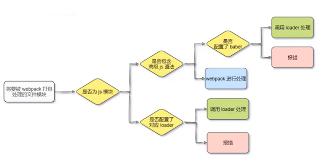

# Note of Vue

## 前端工程化

将前端开发所需要的工具、技术、流程、经验等进行规范化、标准化

- 模块化（JS的模块化，CSS的模块化，资源的模块化）
- 组件化（复用现有的UI结构、样式、行为）
- 规范化（目录结构划分、编码规范化、接口规范化、文档规范化、git分支管理）
- 自动化（自动化构建、自动部署、自动化测试）

目前主流的前端工程化解决方案：

- webpack（重点）
- parcel：侧重第三方包

## webpack

概念：前端工程化的具体解决方案

主要功能：

- 前端模块化开发支持
- 代码压缩混淆
- **处理浏览器JS兼容支持**（自动转为兼容的写法）
- 性能优化

## webpack 基本使用

安装 jQuery（记录在dependencies结点下）:

```
npm i jquery -S
```

安装webpack（记录在devDependencies）：

```
npm install webpack@5.42.1 webpack-cli@4.7.2 -D
```

在项目中配置 webpack：

- 在项目根目录中，创建名为 `webpack.config.js`的配置文件：

  ```js
  // 使用 node js地导出故语法，向外导出一个 webpack 的配置对象
  
  module.exports = {
      // mode 指定构建模式 可选值为 development 和 production
      mode: 'development'
  }
  ```

- 在`package.json`文件的scripts节点下，新增dev脚本：

  ```
  "scripts":{
  	"dev": "webpack"
  }
  ```

  (scripts节点下的脚本，可以通过npm run 执行，例如 npm run dev)

- 在终端中运行 npm run dev命令，启动webpack进行项目打包构建，此时会自动生成dist目录的js文件，导入此文件即可使用

压缩：将`mode`改为`production`，然后重新 npm run dev（但是打包速度很慢，因此开发阶段使用development，开发结束上线的时候使用production）

### webpack.config.js文件的作用

`webpack.config.js`是webpack的配置文件，webpack在打包构建之前，会先读取这个配置文件，然后对项目进行打包

由于webpack是基于node.js开发出来的打包工具，因此在其配置文件中，支持使用node.js相关的语法和模块进行个性化配置 

### 默认约定

webpack 4和5版本中，默认约定：

- 默认的打包入口文件是 src -> index.js
- 默认的输出文件路径为 dist -> main.js

可以根据需要在 `webpack.config.js`中修改打包的默认约定

### 修改输入文件和输出文件

在`webpack.config.js`配置文件中，可以通过entry节点指定打包的入口，通过output节点指定打包的出口：

```js
const path = require('path')
module.exports = {
    // mode 指定构建模式 可选值为 development 和 production
    mode: 'production',
    // 打包入口文件路径
    entry: path.join(__dirname, './src/index.js'),
    output:{
        // 输出文件的存放路径
        path: path.join(__dirname, './dist'),
        // 输出文件的名称
        filename: 'bundle.js',
    }
}
```

 ## webpack插件

### webpack-dev-server

该插件作用类似 nodemon 工具，每次修改源代码的时候，webpack会自动进行打包和构建

**安装:** 注意记录在开发节点上，该工具应只在开发阶段使用

```
npm install webpack-dev-server -D
```

**配置：** 修改 `package.json`的scripts为：

```
"scripts":{
	"dev": "webpack serve"
}
```

 保存后再次运行 `npm run dev`，注意 webpack-dev-server 会启动一个实时打包的http服务器，因此要在浏览器中访问`http://localhost:8080`

注意这里可能会出现错误：

```
[webpack-cli] Unable to load '@webpack-cli/serve' command
[webpack-cli] TypeError: options.forEach is not a function
```

这时候需要安装一下 `webpack-cli` ： 

```
npm install webpack-cli -D
```

注意此时打开`http://localhost:8080`出现 `cannot get`错误，需要在`webpack.config.js`文件中进行配置devServer：

```js
// 使用 node js地导出故语法，向外导出一个 webpack 的配置对象
const path = require('path')
module.exports = {
    // mode 指定构建模式 可选值为 development 和 production
    mode: 'development',
    // 打包入口文件路径
    entry: path.join(__dirname, './src/index.js'),
    output:{
        // 输出文件的存放路径
        path: path.join(__dirname, './dist'),
        // 输出文件的名称
        filename: 'bundle.js',
    },
    devServer: {
        //....//
        static: {                               
          directory: path.join(__dirname, './'),  
          watch: true
        }
     }
}
```

注意：由于在实际运行中会多次进行保存，因此webpack-dev-server并没有真正打包修改输出的js文件，而是输出同名的js文件到内存中，因此如果想要看到修改后实时的效果，需要将js文件引入的地方改为内存中的js文件：

```html
这是实际输出的js文件
<!-- <script src="../dist/main.js"></script> -->
实时改变效果的内存js文件
<script src="/bundle.js"></script>
```


### html-webpack-plugin

webpack中的HTML插件，其功能类似一个模板引擎插件，可以通过该插件定制 index.html 的内容

#### 安装

记录到开发节点中：

```
npm install html-webpack-plugin -D
```

#### 配置

在`webpack.config.js`中进行配置：

```js
// ...
// 导入插件 返回构造函数（因此大写）
const HtmlPlugin = require('html-webpack-plugin')

const htmlPlugin = new HtmlPlugin({
  template: './src/index.html',
  filename: './index.html',
})

module.exports = {
  // ...
  // 通过plugins节点 使htmlPlugin生效
  plugins:[htmlPlugin],
}
```

#### 功能

可以实现将 src 文件夹下的 index.html 文件复制到根目录下，实现在 `http://localhost:8080`的直接访问（注意这里复制后的文件并不存在与磁盘中，而是在内存中）

- 通过HTML插件复制项目根目录中的index.html页面早内存中
- HTML插件在生成的index.html页面自动注入打包的bundle.js文件

### devServer节点

在`webpack.config.js`文件中，可以通过`devServer`节点进行更多配置：

```js
  devServer: {
    //....//
    open: true,   // 初次打包完成后自动打开浏览器
    host: '127.0.0.1',  // 实时打包使用的主机地址
    port: 80,   // 实时打包使用的端口号
    static: {
      directory: path.join(__dirname, './'),
      watch: true
    }
```

注意修改配置文件后，必须重启打包服务器，否则最新的配置文件无法生效

### loader

实际开发过程中， webpack默认只能处理js为后缀的模块，对于其他非js后缀的模块，webpack默认处理不了，需要调用loader加载器才能正常打包，webpack加载的作用为协助webpack打包处理特定的文件模块，例如：

- css-loader：可以打包处理css为后缀的文件
- less-loader：打包处理less为后缀的文件
- babel-loader：打包处理webpack无法处理的高级js语法

### loader 调用过程



### loader 处理css文件

流程：

- 安装：记录到开发节点上

  ```
  npm install style-loader css-loader -D
  ```

- 在`webpack.config.js`文件中进行配置：

  ```js
  module:{
      rules:[
          // 定义不同模块对应的loader
          {test: /\.css$/, use: ['style-loader', 'css-loader']}
      ]
  },
  ```

  其中 test 表示匹配的文件类型，use 表示对应要调用的 loader，**注意 use 的书写是有严格先后顺序的，多个 loader 调用的顺序是从后往前调用**

- 打包的执行顺序：

  - webpack 打包所有的 js 文件
  - 遇到 css 文件时候查找配置文件，在 module.rules 数组中查找 loader
  - 从后往前：首先将 css 文件交给 css-loader 处理
  - 将 css-loader 处理的结果转交给 style-loader
  - style-loader 处理完毕后，将处理的结果转交给 webpack
  - webpack 把 style-loader 处理的结果合并到 `/dist/bundle.js`中，生成打包好的文件

### loader 处理less文件

#### 安装  & 配置

流程：

- 安装命令：（记录到开发节点）注意这里后一个less为内置loader

  ```
  npm install less-loader less -D
  ```

- 在`webpack.config.js`文件中配置，添加loader规则：

  ```js
  module:{
  	rule: {
  		{test: '/\.less$/', use:['style-loader', 'css-loader', 'less-loader']}
  	}
  }
  ```

  注意 less-loader 是依赖于之前 css-loader的

### base64图片

页面加载的时候会先加载标签结构，然后请求图片等资源，因此对于较小的图片，可以进行性能优化的方法有：

- 精灵图：将多个较小的图片合并为一张大图片，然后通过定位截取不同的图片
- base64图片：将图片转化为字符串

将图片转化为base64字符串可以减少页面对于图片资源的请求，但是会增大图片，因此不适合较大图片使用

### url  loader加载

#### 安装 & 配置

流程：

- 安装命令：记录到开发节点：

  ```
  npm install url-loader file-loader -D
  ```

- 在 `webpack.config.js`文件中添加 loader 规则：

  ```js
  module:{
  	rules:[
  		{test: /\.png|jpg|gif$/, use: 'url-loader?limit=22229'},
  	]
  }
  ```

  注意 use 只有一个值，因此没有使用数组形式，其中`?`后面是指定 loader 的参数，单位为字节（byte），并且只有小于等于limit的图片，才会被转换为base64格式图片

### 打包处理 js 文件中的高级语法

webpack 只能打包处理一部分高级的 js 语法，对于那些 webpack 无法处理的高级 js 语法，需要借助 babel-loader 进行打包处理

#### 安装 & 配置

流程：

- 安装依赖：（开发节点）

  ```
  npm install babel-loader @babel/core @babel/plugin-proposal-decorators
  ```

- 配置`webpack.config.js`，添加 loader 规则：

  ```
  {test: /\.js$/, use: 'babel-loader', exclude: /node_modules/},
  ```

- 在项目根目录下，创建 `babel.config.js` 的配置文件，定义 babel 的配置项如下：

  ```
  module.exports = {
      plugins: [['@babel/plugin-proposal-decorators', {legacy:true}]]
  }
  ```


### 开发与发布

发布方法：在 `package.json`文件的scripts节点下， 新增 build 命令：

```
"scripts":{
	开发模式使用 dev 命令 serve 将生成的js等文件保存在内存中
	"dev": "webpack serve"  
	项目发布时使用 build 命令 并且将 mode 覆盖为 production
	"build": "webpack --mode production"
}
```

其中`--mode`是一个参数项，用于指定 webpack 的运行模式，处于 production 模式下表示进行代码压缩和性能优化（通过`--mode`设置的参数会覆盖 `webpack.config.js`文件中的 mode 选项）

### 优化图片和js文件路径

#### js 文件的归类

将发布的 js 文件统一放到 js 文件夹下，配置 `webpack.config.js`文件的 output 节点（其实就是在输出路径前面加一级文件夹）：

```
output:{
	...
	filename: 'js/bundle.js'
}
```

#### 图片的归类

将所有的图片放在 images 文件夹下：修改`webpack.config.js`文件中的 url-loader 配置项，用参数 outputPath 指定输出路径：

```
{
	test ...
	// 使用 url 传递参数方式
	use: 'url-loader?limit=111&outputPath=images'
	// 使用对象方式
	use:{
		loader: 'url-loader',
		options:{
			limit: 2222,
			outputPath: 'images'
		}
	}
}
```

### 自动删除旧版本的 dist 目录

在进行发布时，旧版本 dist 文件夹中的文件如果不在文件覆盖范围内会保留到新发布的 build 文件夹中，为了消除这种影响，需要在发布之前手动删除 dist 文件夹，也可以使用 clean-webpack-plugins 插件进行自动删除：

#### 安装 & 配置

流程：

- 安装：（安装命令参考 npmjs 文档）

  ```
  npm install clean-webpack-plugins -D
  ```

- 配置 `webpack.config.js`文件：

  ```
  // 导入插件 得到插件的构造函数 并创建实例对象
  // 解构赋值
  const {CleanWebpackPlugin} = require('clean-webpack-plugin')
  const cleanPlugin = new CleanWebpackPlugin()
  ```

- 挂载：

  ```
  // 将自动删除旧dist的文件夹的插件挂载到plugins节点上
  plugins:[htmlPlugin, cleanPlugin],
  ```

### SourceMap

SourceMap 是一个信息文件，里面储存的是位置信息（原始文件与生成文件之间的位置对应关系），也就是说，SourceMap 文件中存储压缩混淆后的代码所对应的转换前的位置，这样排查错误的工具会直接显示原始代码而不是转换后的代码，方便后期的调试

#### 开发环境

开发环境下，为了方便调试，推荐在 `webpack.config.js` 文件中添加 devtool 配置：

```
// 开发模式下使用此设置 生产模式中不建议使用
devtool: 'eval-source-map',
```

#### 生产环境

生产环境下省略 devtool 选项，则最终文件中不包含 Source Map，这样能够防止原始代码通过 source map 形式暴露出去，防止别人直接得到源代码（安全性）

#### 折中方法

生产环境下为了安全考虑不应该显示错误行号信息，因此可以修改配置为：

```
devtool: 'nosources-source-map',
```

这样发布之后报错信息只会显示错误位置行号，而不会暴露源码

#### 总结

- 开发环境：
  - `devtool`设置为 `eval-source-map`
  - 可以精准定位到具体错误行
- 生产环境：
  - 关闭 SourceMap 或将 devtool 设置为 `nosources-source-map`
  - 防止源码泄露
- **注意！！！**
  - 实际开发中会使用CLI一键生成带有 webpack 的项目，无需自己配置

### `@`路径

`@`表示 src 源代码目录，在项目中导入模块的时候，建议使用`@`从根目录向下查找，而不是使用多个`../`自内往外查找，例如：

```
src -
    - msg.js
    - test
           - t.js
           
msg.js 的路径为 @/msg.js
t.js 的路径为 @/test/t.js
```

**注意：**在 webpack 中需在 `webpack.config.js`中配置：

```
  resolve: {
    alias: {
      '@': path.join(__dirname, './src/')
    }
  },
```

## 安装 Vue devtools 插件

在浏览器开发者模式下安装 vue_devtools.crx ，-> “详情”   -> 打开“允许访问文件网址”